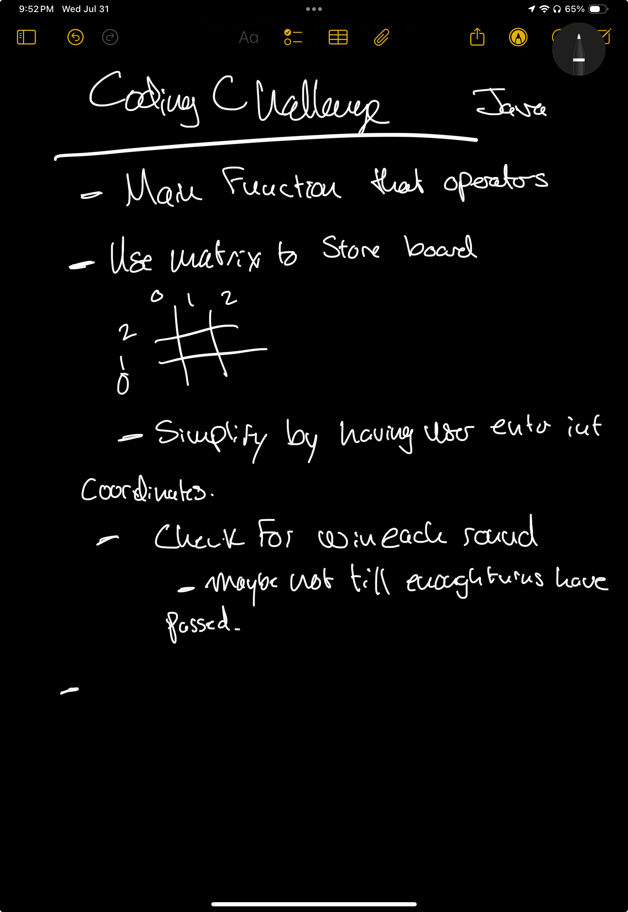

# Tic-Tac-Toe Program

The runtime can be downloaded at {placeholder}

Here is my pathetic handwritten notes on how I would outline it.
In my classic self, I started writing notes, and then stopped because I felt like i was wasting time and just started putting what was floating around in my mind into code.

I spent about 2 hours to work to create the code and the supporting files in this repository.
